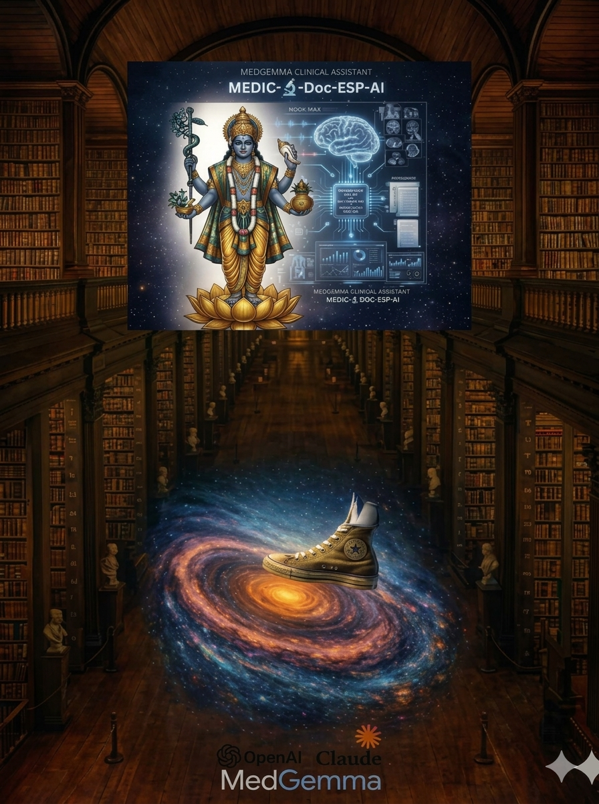

<p align="center">
  
</p>

<h1 align="center">roc7d‑labs</h1>

<p align="center">
  Advancing privacy‑preserving multimodal medical AI through local inference, secure architectures, and applied research.
</p>

---

## 🧬 About Us

**roc7d‑labs** is an independent research group focused on building **local, private, multimodal medical AI systems**.  
Our work emphasizes:

- **Local inference** (no cloud dependency)
- **Medical safety + privacy**
- **Multimodal intelligence** (text, vision, audio)
- **Efficient model deployment on consumer hardware**
- **Reproducible research and transparent engineering**

We develop practical tools and prototypes that enable clinicians, researchers, and engineers to explore medical AI safely and privately.

---

## 🔬 Current Flagship Project

### **Medic‑🔬‑Doc‑ESP‑AI**
A multimodal medical AI assistant designed for:

- Medical Q&A (text)
- Medical image interpretation (vision)
- Medical audio transcription (speech)
- Local execution on macOS and Linux
- Strict privacy and confidentiality

Repo:  
👉 https://github.com/roc7d-labs/medic-doc-esp-ai

---

## 🧠 Multi-Modal Diagnostic Engine

The visual interface to the right of Shri Dhanvantari represents the digital "brain" of the Medic‑🔬‑Doc‑ESP‑AI application, powered by **MedGemma** and **BiomedCLIP**.

The application's core is a **Multi-modal RAG (Retrieval-Augmented Generation)** system. Unlike standard AI, it doesn't just "read" text — it "sees" and "hears" medical data to provide a **360-degree clinical view**.

### 🩻 Advanced Diagnostic Imaging

This feature expands the application's ability to interpret complex, multi-dimensional medical imaging, moving beyond simple 2D X-rays:

- **3D Volume Interpretation** — Analyzing CT and MRI scans to localize anatomical features and anomalies with high precision
- **Histopathology at Scale** — Simultaneous interpretation of multiple patches from whole-slide images (WSI) to distinguish between tissue types, such as normal mucosa versus adenocarcinoma
- **Longitudinal Tracking** — Comparing current chest X-rays against historical scans to detect subtle changes over time

### 🔊 Acoustic & Clinical Intelligence

The integration of **CLAP (Contrastive Language-Audio Pretraining)** allows the assistant to process audio-based medical data, bridging the gap between sound and diagnosis:

- **Vital Sign Estimation** — Using HeartCLAP to estimate heart rates directly from phonocardiogram (PCG) audio signals
- **Speech-to-Text (STT)** — Converting patient interviews or physician notes from `.wav` files into structured clinical data like SOAP notes (Subjective, Objective, Assessment, and Plan)
- **Intelligent Triage** — Powering virtual assistants that guide patients through context-aware symptom checks, gathering structured data before they even see a doctor

### 🤖 Strategic AI Capabilities

The "AI" nodes represent more than just processing — they symbolize the application's ability to act as a **Clinical Co-pilot**:

- **Structured Data Extraction** — Automatically pulling values and units from unstructured lab reports to populate Electronic Health Records (EHR)
- **Zero-Shot Classification** — Using BiomedCLIP to identify rare medical conditions in images without needing thousands of previously labeled examples
- **Privacy-Preserving Analysis** — Using public images from the PMC-15M dataset as "proxies" to analyze sensitive patient data without exposing the original files to external models

---

## 🏗️ Technical Architecture

### Model Stack

| Model | Purpose | Format |
|-------|---------|--------|
| **MedGemma 1.5 4B-IT** | Clinical text Q&A, medical reasoning | SafeTensors (FP16) |
| **LLaVA v1.6 Mistral 7B** | Vision-language diagnostic imaging | GGUF (Q4_K_M / Q5_K_M) |
| **Phi-4** | General medical assistant | GGUF (Q4_K_M / Q4_K_S / Q5_K_M) |
| **BiomedCLIP** | Medical image-text embeddings | HuggingFace (FP32) |
| **BiomedBERT** | Clinical text embeddings for RAG | HuggingFace (FP32) |
| **Faster-Whisper** | Audio transcription (tiny → medium) | CTranslate2 (INT8) |

### Pipeline Components

```
┌────────────────────────────────────────────────────────┐
│                   Medic-🔬-Doc-ESP-AI                  │
├──────────┬──────────────┬──────────────┬───────────────┤
│ 🔊 Audio │  🩻 Vision   │ 💬 Text Q&A  │  🔒 Backend   │
│ Pipeline │  Pipeline    │  Pipeline    │  API          │
├──────────┼──────────────┼──────────────┼───────────────┤
│ Faster-  │ LLaVA v1.6   │ MedGemma     │ FastAPI       │
│ Whisper  │ MedGemma     │ Phi-4        │ JWT Auth      │
│ CLAP     │ BiomedCLIP   │ BiomedBERT   │ Audit Trail   │
│          │              │ Qdrant (RAG) │ SQLite        │
├──────────┴──────────────┴──────────────┴───────────────┤
│        🖥️ Frontend: Tauri 2 + Next.js 16               │
│        React 19 · TypeScript 5.9 · Tailwind 4          │
│        shadcn/ui · AI SDK · wavesurfer.js · MCP SDK    │
└────────────────────────────────────────────────────────┘
```

### Evaluation Datasets

| Domain | Dataset | Description |
|--------|---------|-------------|
| **X-Ray** | COVID-19 Chest X-Ray | ~600+ annotated radiographs with severity scores, bounding boxes, lung masks |
| **Ultrasound** | EDUS2 Point-of-Care | FAST, cardiac, cholecystitis, hemothorax, hydronephrosis, IUP, PCE clips |
| **Audio** | Hani89 Synthetic Medical Speech | HuggingFace synthetic medical dialogues |
| **Audio** | MedDialog-Audio | Medical dialog audio corpus |
| **Audio** | Kaggle Respiratory Sounds | Lung auscultation recordings |
| **Audio** | PhysioNet Heart Sounds | Cardiac auscultation (training sets A–F) |

### Key Project Files

| File | Purpose |
|------|---------|
| `audio_transcribe.py` | Whisper-based medical audio transcription |
| `ask.py` | Interactive CLI for medical Q&A |
| `medical_qa.py` | Text-based medical Q&A pipeline |
| `vision_qa_fixed_telemetry.py` | Vision Q&A with diagnostic imaging |
| `phi4_medical_production.py` | Production Phi-4 inference pipeline |
| `backend/services/rag_retriever.py` | RAG retrieval with Qdrant vector search |
| `backend/services/embedding_service.py` | BiomedBERT embedding generation |
| `backend/services/audit_service.py` | JSONL compliance audit trail |
| `api/main.py` | FastAPI server entry point |

All models run locally — **zero data leaves the machine**.

---

## 🔐 Licensing Philosophy

Our work uses a **Custom Dual License**:

- **Non‑commercial use permitted**
- **Commercial use requires explicit written permission**
- **Strict no‑redistribution and no reverse engineering**

This ensures responsible use of medical AI technologies.

---

## 🧩 Organization Structure

- **medic-doc-esp-ai** — Multimodal medical AI assistant  
- **model‑research** — Experiments, quantization, benchmarks  
- **datasets‑tools** — Preprocessing, augmentation, evaluation  
- **inference‑engines** — Local inference pipelines and utilities  

More repositories will be added as research expands.

---

## 📫 Contact

For collaboration or licensing inquiries:

**roc7d‑labs**  
📧 Email: roc7d.labs@gmail.com 
🌐 GitHub: https://github.com/roc7d-labs

---

<p align="center">
  <sub>© 2026 roc7d‑labs — All rights reserved.</sub>
</p>
